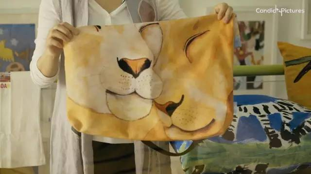

康睿像星星一样纯洁，
也像星星一样冷漠。
他不懂沟通，没有朋友。
他可能无法给母亲一个拥抱，
却能描绘出最温情的画面。
一个时装周的舞台，
给了康锐向世界表达自己的机会。

康睿，从小患自闭症的17岁大男孩，5岁喜欢上绘画。

环保袋上母子相依的画面，就是康瑞所画，并取名《暖》。

康睿因语言沟通障碍几乎没有朋友，唯一与外界沟通的媒介便是画画，他也很喜欢用画笔表达自己的想法。

2017年康睿获得了一个展现绘画作品的机会。他和其他自闭症儿童绘画设计的作品被派克兰帝嵌入到童装背包上，亮相北京时装周，让全世界看到了他的作品。

康睿看到自己的作品在北京时装周上绽放，那一刻，他是世界上最幸福的人。