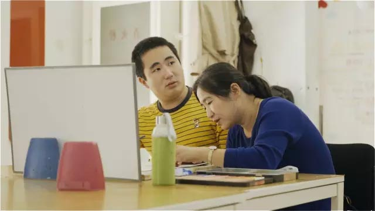
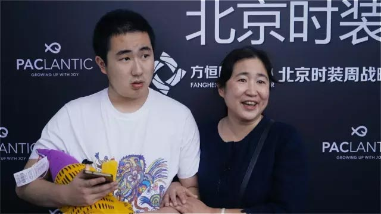

上帝关上了你的语言之门
但世界不应有其实，人们之间心灵中没有不同
艺术之门为自闭症儿童展开另一个世界
世界有了色彩，阳光也为你跳跃
手和画笔成为了美的语言
蓝海云制作人团队深入北京时装周，挖掘背后的鲜为人知的故事
光线夺目的时尚，也可以是拯救灵魂的伊甸园

康睿看到了自己的作品可以在舞台上发光
发现他自己也可以有被爱的时候
“他笑了” 这世界充满爱
妈妈也终于放下心灵重担
看到了生命的希望 和 爱的光芒

