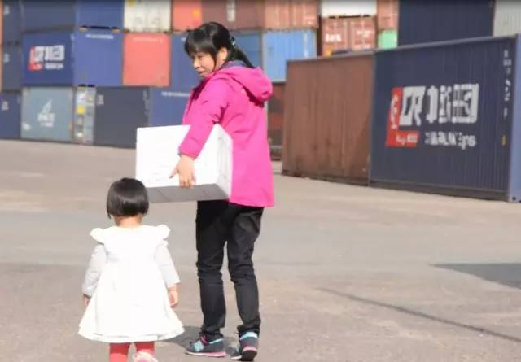

华沙，杭州，两座城，一对母女，阔别18年，谁来帮助她们跨越这9800公里的距离？

42岁的菲菲有个难言的心结
18年前的一个风雨夜，她毅然决定抛家弃女只身一人跑来华沙打拼。

18年后的今天，昔日襁褓中的女儿已长成了婷婷的少女，菲菲也在华沙有了自己的生意和一份安定的生活。

然而对女儿心里的愧疚在菲菲心理却从来没有减少过，华沙到杭州，9800公里，横跨欧亚，山高路遥。菲菲回家的次数屈指可数。
女儿说，她已经不记得妈妈长什么样了。

以下部分节选自菲菲的日记

5月18日 晴
今天的天气很好，正如我的心情，因为今天要给我最爱的囡囡寄礼物。
 
这次的感觉有点不同，这是我第一次走铁路给囡囡寄礼物。以前总是嫌贵不舍得空运，等海运到家都是好几个月之后的事儿了，好几次礼物都坏掉了。
……

那么多的集装箱，好震撼啊，都是发往祖国的，蹒跚的小妹也瞪大了眼睛拽着我的衣角开心的笑。
帅气的班列大哥接过给囡囡的礼物后给了我很阳光很阳光的笑容，看着发往家乡的列车，想到10天后囡囡接到礼物的表情，我真的好激动。
……