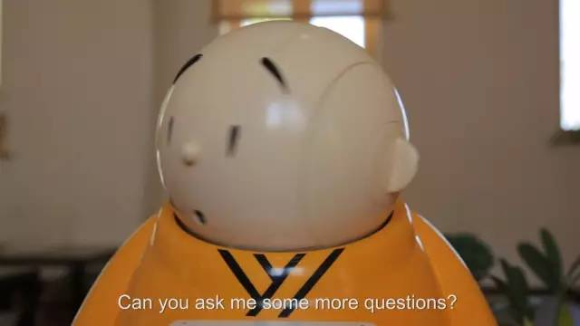
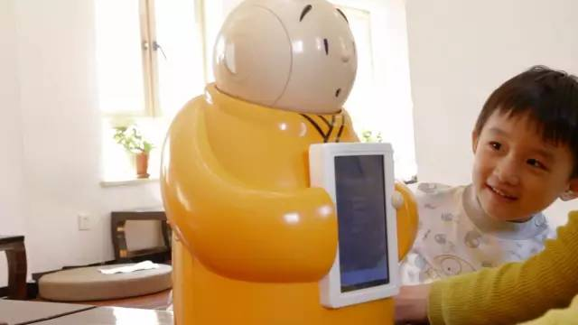
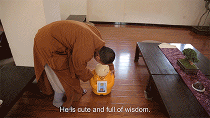
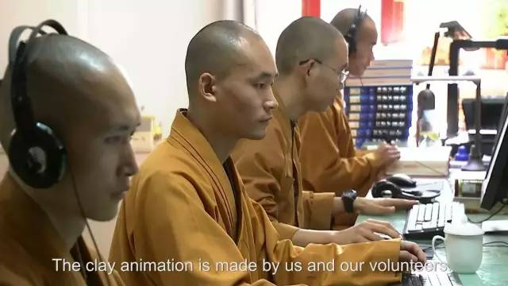

机器人，智能。
小和尚，呆萌。
龙泉寺机器僧贤二恰是两者结合。
卡通形象配上高科技内核，可爱中透露出一丝酷炫。
至关重要的是它生来会说佛经佛法。

机器僧贤二，身高近60厘米，身穿黄色僧袍，卡通呆萌。

它会说话、会唱歌，更有独家绝活会弘扬佛法。

贤二的可爱形象更是备受宠爱，已经被推广到绘画、卡通、书籍等领域。

机器僧是龙泉寺贤帆师父借用高科技来弘扬佛法的一次创举，是高科技与中国传统文化相结合的有益尝试。

目前贤二的二代正在紧锣密鼓的升级开发中。